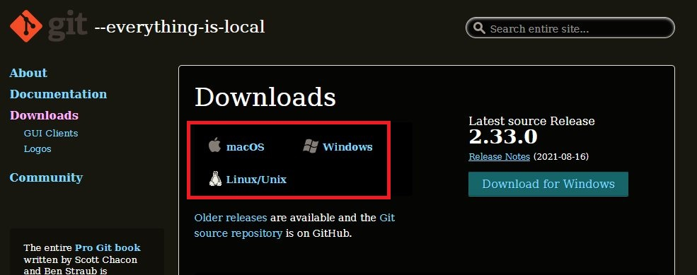
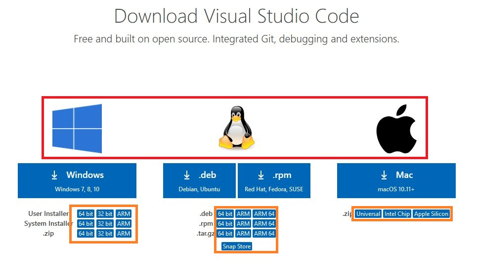
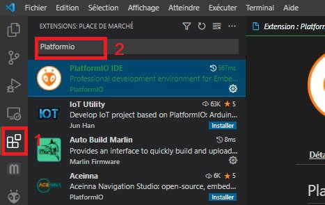
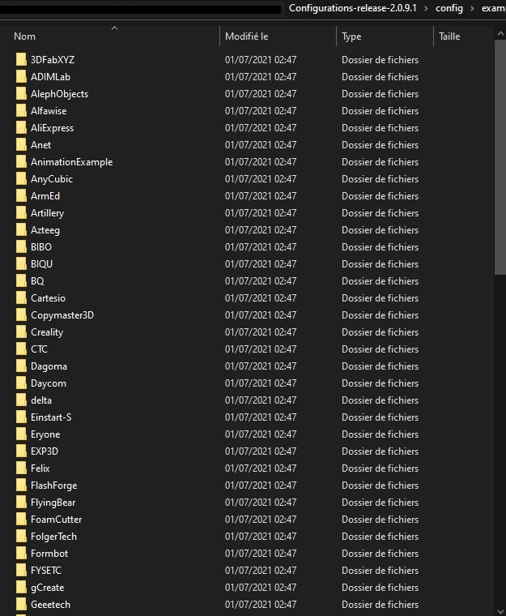
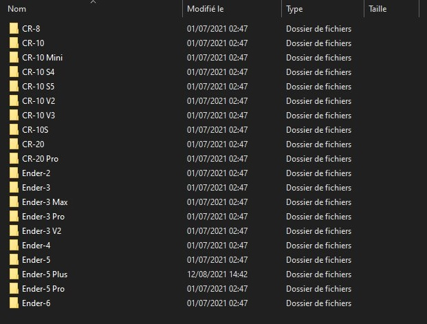

### Installer Git bash
- Télécharger et installer la version actuelle de [Git](https://git-scm.com/downloads) en fonction de votre OS (Windows, Linux, Mac)

### Installer Python
- Télécharger et installer la version actuelle de [Python](https://www.python.org/downloads/) en fonction de votre OS (Windows, Linux, Mac)

### Comment installer VSC et Auto Build Marlin + Platformio IDE pour compiler

- Télécharger Visual Studio Code (VSC) à partir d'[ici](https://code.visualstudio.com/Download)
Le choix dépend du système d'opérations (OS) de l'ordinateur (Windows (7, 8, 10) / Linux / Mac) et de l'architecture (32 / 64bits).

  Après téléchargement, un double-clic pour lancer l'installation de VSC. Après installation, ouvrir VSCode.
- Il faudra ensuite installer l'extension «Auto Build Marlin», clic sur le ① indiqué dans l'image ci-dessous, saisir Auto Build Marlin (ABM) dans ② puis cliquer ③ Installer pour finaliser l'installation.

Normalement, l'installation de «ABM» devrait avoir également installé en dépendance Platformio IDE. Si ce n'était pas le cas :

- Installer l'extension «Platformio IDE», comme pour ABM, clic sur le ① indiqué dans l'image ci-dessous, saisir Platformio IDE dans ② puis cliquer ③ Installer pour finaliser l'installation. 

Après installation de ces extensions, il faudra probablement effectuer un rechargement pour que ce soit pris en compte via Recharger 

Une fois ces installations réussies, après un nouveau rechargement, Auto Build Marlin et PlatformIO sont installés et apparaissent dans la liste des extensions (plugins) dans la partie gauche de VSCode.

- Un clic sur l'icône du plugin PlatformIO (①) (une tête de fourmi voire pour certains un «alien») pour le sélectionner, puis un dernier clic sur ② Ouvrir un projet (Open Project) pour ouvrir le projet et pouvoir commencer à travailler avec.

- Pour compiler un Marlin, il faut au préalable avoir récupéré les sources fournies sous forme d'une archive compressée

- Décompresser l'archive récupérée à l'issue du téléchargement, un dossier Marlin-2.0.x doit avoir été créé. C'est ce dossier qu'il faut indiquer lors de l'ouverture du projet via Platformio (le fichier platformio.ini doit y être ainsi qu'un dossier Marlin contenant les fichiers sources qui serviront lors de la compilation)

- Il est recommandé de récupérer les exemples de configuration d'imprimantes proposés par l'équipe du Marlin. De nombreux constructeurs et modèles d'imprimantes y sont listés

Exemples du fabricant Creality :

Pour une Creality Ender3, il n'y a que l'embarras du choix en fonction de la carte mère installée sur l'imprimante. Il suffira de recopier les fichiers configuration[_adv].h et éventuellement les [boot|status]screen.h dans le dossier nommé Marlin en remplacement de ceux originaux pour se faciliter les étapes liées au paramétrage avant de lancer la compilation

Bonne(s) compilation(s)
