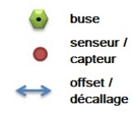
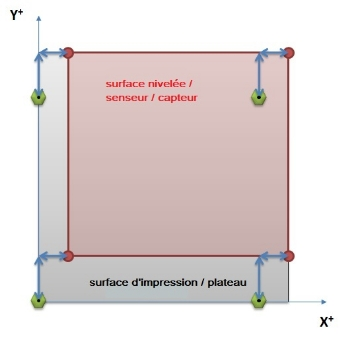
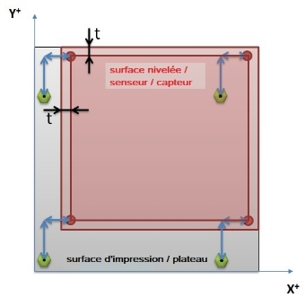
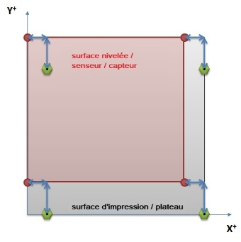
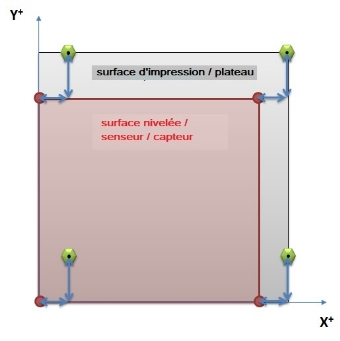
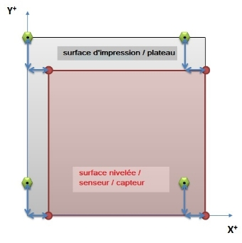
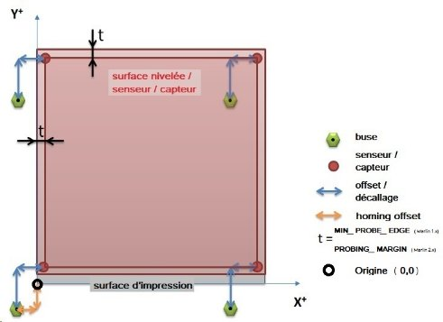
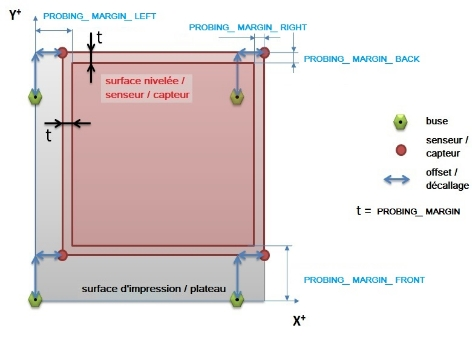

# Paramétrer Marlin pour un capteur de nivellement (Z probe)

De nombreuses questions se posent régulièrement sur ce point.

Ce sujet tente de faire le point sur la manière dont Marlin gère les emplacements du capteur de nivellement par rapport à la buse. [Le type de capteur](https://marlinfw.org/docs/configuration/probes.html#2.-probe-type) n'a pas d'importance, il peut s'agir d'un BLTouch (ou d’un clone / copie), d’un Touchmi, d'un capteur inductif, capacitif, …, tant que l’on est en mesure de déterminer le décalage de celui-ci par rapport à la buse (***ceci ne s’applique pas aux capteurs où la buse elle-même fait office de sonde (piezo, pression, …)***).

Pour commencer, on suppose que la buse ne peut qu’atteindre la totalité de la surface du lit d’impression, sans espace supplémentaire. Ainsi les limites du plateau utilisées sont celles définies dans le fichier «*configuration.h*» à la section **[machine]** :

```
// The size of the print bed
#define X_BED_SIZE 200
#define Y_BED_SIZE 200

// Travel limits (mm) after homing, corresponding to endstop positions.
#define X_MIN_POS 0
#define Y_MIN_POS 0
#define Z_MIN_POS 0
#define X_MAX_POS X_BED_SIZE
#define Y_MAX_POS Y_BED_SIZE
#define Z_MAX_POS 200
```
Cette hypothèse permet d'éviter que le chariot portant la tête ne se positionne à des emplacements pouvant provoquer des dommages au matériel. Cependant si des déplacements supplémentaires sont possibles, un décalage complémentaire pourra ensuite être ajouté aux limites.

En premier lieu, il faut déterminer le décalage du capteur (par mesures directes ou en se fiant aux informations (quand / si elles sont fournies) du support de capteur imprimable récupéré sur un des nombreux sites de partage sur Internet ([Thingiverse](https://www.thingiverse.com/) ou un autre) par rapport à la buse.

## 1. Marlin

***Les directives de compilation diffèrent en fonction de la version de Marlin***

Pour la**branche 2.0.x de Marlin**, une seule directive définit la marge de «sécurité» utilisée par le capteur pour rester en dehors des bords du lit, par exemple pour éviter les pinces de maintien d’une vitre sur le plateau. Cette marge définit le décalage par rapport au bord du lit :

- `PROBING_MARGIN`  (*configuration.h*)

Cette valeur pourra ensuite être utilisée dans «*configuration_adv.h*», section **[Probing Margins]** :

```
#if PROBE_SELECTED && !IS_KINEMATIC
   //#define PROBING_MARGIN_LEFT PROBING_MARGIN
   //#define PROBING_MARGIN_RIGHT PROBING_MARGIN
   //#define PROBING_MARGIN_FRONT PROBING_MARGIN
   //#define PROBING_MARGIN_BACK PROBING_MARGIN
#endif
```
Ces paramètres précisent les limites du palpage avec le [Gcode G29](https://marlinfw.org/docs/gcode/G029.html). C’est **une portion du plateau d’impression** car les capteurs / sondes ne sont généralement pas en mesure d'atteindre tous les points que la buse peut atteindre. Il faut donc tenir compte des décalages XY de la sonde lors de la définition de ces limites.

Dans **Marlin 1.1.x**, la marge de «sécurité» était déclarée via la directive :

- `MIN_PROBE_EDGE`

Les positions limites (positions absolues) que le capteur pouvait atteindre étaient déclarées ensuite, toujours dans «*configuration.h*», dans la section dépendant du mode de nivellement :
```
// Set the boundaries for probing (where the probe can reach).
//#define LEFT_PROBE_BED_POSITION MIN_PROBE_EDGE
//#define RIGHT_PROBE_BED_POSITION (X_BED_SIZE - MIN_PROBE_EDGE)
//#define FRONT_PROBE_BED_POSITION MIN_PROBE_EDGE
//#define BACK_PROBE_BED_POSITION (Y_BED_SIZE - MIN_PROBE_EDGE)
```

# Décalage du capteur

Dans la version stable actuelle de Marlin 2.0.X (au moment de l’écriture, la 2.0.9.3), les valeurs de décalages sont déclarées dans un tableau :

`#define NOZZLE_TO_PROBE_OFFSET { XXX, YYY, ZZZ }`

où XXX et YYY sont les décalages **en millimètres** (offset) du centre du capteur par rapport à la buse (***vue de l'avant de la machine***) :

- Si les **deux valeurs** sont **positives**, le capteur est situé à l'**arrière-droit**,
- si les **deux** sont **négatives**, la position est à l’**avant-gauche** ,
- les autres positions possibles sont l'**arrière-gauche** et l'**avant-droit** (**une valeur positive et une négative**).

Marlin fournit un dessin en ASCII pour le rappeler :

```
*     +-- BACK ---+
*     |    [+]    |
*   L |        1  | R <-- Example "1" (right+,  back+)
*   E |  2        | I <-- Example "2" ( left-,  back+)
*   F |[-]  N  [+]| G <-- Nozzle
*   T |       3   | H <-- Example "3" (right+, front-)
*     | 4         | T <-- Example "4" ( left-, front-)
*     |    [-]    |
*     O-- FRONT --+
```

Pour rappel avec un Marlin 1.1.9.1, la position du capteur était définie à l'aide des constantes suivantes :

```
#define X_PROBE_OFFSET_FROM_EXTRUDER [XXX]   // X offset: -left  +right  [of the nozzle]
#define Y_PROBE_OFFSET_FROM_EXTRUDER [YYY]   // Y offset: -front +behind [the nozzle]
```

# Limites de la zone du capteur

Dans les dessins suivants, la buse, le capteur et les décalages sont définis par :



Quatre positions sont possibles pour le capteur (*une cinquième existe pour la buse faisant office de capteur, dans ce cas il n’y a plus de décalage puisque palpeur et buse sont à la même position* :smirk: ), ce qui donne les schémas suivants pour les limites de la zone du capteur (zone rouge transparente) :

# 1. Capteur à l'arrière-droit :



Le capteur peut atteindre les bords arrière et droite, les limites sont donc fixées par :

**Marlin 1.x :**

```
#define LEFT_PROBE_BED_POSITION (X_PROBE_OFFSET_FROM_EXTRUDER)
#define RIGHT_PROBE_BED_POSITION (X_BED_SIZE)
#define FRONT_PROBE_BED_POSITION (Y_PROBE_OFFSET_FROM_EXTRUDER)
#define BACK_PROBE_BED_POSITION (Y_BED_SIZE)
```

**Marlin 2.x :**

Pas besoin de déclarer les positions gauche, droite, avant, arrière explicitement car avec cette version de Marlin la calcul est automatique à partir de la déclaration `NOZZLE_TO_PROBE_OFFSET`

Si un décalage de «sécurité» a été défini par :

- `#define **MIN_PROBE_EDGE** [valeur]` (**Marlin 1.x**) ou

- `#define **PROBING_MARGIN** [valeur]` (**Marlin 2.x**)
```
    - //#define PROBING_MARGIN_LEFT PROBING_MARGIN
    - //#define PROBING_MARGIN_RIGHT PROBING_MARGIN
    - //#define PROBING_MARGIN_FRONT PROBING_MARGIN
    - //#define PROBING_MARGIN_BACK PROBING_MARGIN
```

dans le fichier «*configuration.h*», **les limites de palpage seront modifiées pour en tenir compte** (**Marlin 2.x**), ce qui donnera la zone en rouge foncé pour la surface palpée (t = MIN_PROBE_EDGE / PROBING_MARGIN) :



Pour un **Marlin 1.x**, les limites deviennent :

```
#define LEFT_PROBE_BED_POSITION (X_PROBE_OFFSET_FROM_EXTRUDER + MIN_PROBE_EDGE)
#define RIGHT_PROBE_BED_POSITION (X_BED_SIZE - MIN_PROBE_EDGE)
#define FRONT_PROBE_BED_POSITION (Y_PROBE_OFFSET_FROM_EXTRUDER + MIN_PROBE_EDGE)
#define BACK_PROBE_BED_POSITION (Y_BED_SIZE - MIN_PROBE_EDGE)
```

# 2. Capteur à l'arrière-gauche :



Le capteur peut atteindre les bords arrière et gauche, les limites sont donc fixées par (**Marlin 1.x**) :

```
#define LEFT_PROBE_BED_POSITION (MIN_PROBE_EDGE)
#define RIGHT_PROBE_BED_POSITION (X_BED_SIZE + X_PROBE_OFFSET_FROM_EXTRUDER - MIN_PROBE_EDGE)
#define FRONT_PROBE_BED_POSITION (Y_PROBE_OFFSET_FROM_EXTRUDER + MIN_PROBE_EDGE)
#define BACK_PROBE_BED_POSITION (Y_BED_SIZE - MIN_PROBE_EDGE)
```

# 3. Capteur à l'avant-gauche :



Le capteur peut atteindre les bords avant et gauche, les limites sont donc fixées par (**Marlin 1.x**) :

```
#define LEFT_PROBE_BED_POSITION (MIN_PROBE_EDGE)
#define RIGHT_PROBE_BED_POSITION (X_BED_SIZE + X_PROBE_OFFSET_FROM_EXTRUDER - MIN_PROBE_EDGE)
#define FRONT_PROBE_BED_POSITION (MIN_PROBE_EDGE)
#define BACK_PROBE_BED_POSITION (Y_BED_SIZE + Y_PROBE_OFFSET_FROM_EXTRUDER - MIN_PROBE_EDGE)
```

# 4. Capteur à l'avant-droit :



Le capteur peut atteindre les bords avant et droit, les limites sont donc fixées par (**Marlin 1.x**) 

```
#define LEFT_PROBE_BED_POSITION (X_PROBE_OFFSET_FROM_EXTRUDER + MIN_PROBE_EDGE)
#define RIGHT_PROBE_BED_POSITION (X_BED_SIZE - MIN_PROBE_EDGE)
#define FRONT_PROBE_BED_POSITION (MIN_PROBE_EDGE)
#define BACK_PROBE_BED_POSITION (Y_BED_SIZE + Y_PROBE_OFFSET_FROM_EXTRUDER - MIN_PROBE_EDGE)
```

Les bases de la définition des limites physiques de la zone du capteur ont été passées en revue.

# CAS OÙ LA BUSE PEUT SE DÉPLACER EN DEHORS DES LIMITES DU PLATEAU

Cela devient légèrement plus compliqué lorsque la tête d'impression peut se déplacer en dehors des limites du plateau.

L'espace de déplacement supplémentaire peut être déclaré dans le fichier de configuration :

```
// Travel limits (mm) after homing, corresponding to endstop positions.
#define X_MIN_POS [XX]
#define Y_MIN_POS [YY]
```

où [XX] et [YY] sont les valeurs de décalage entre le détecteur de fin de course (endstop) et l'origine (les flèches orange représentent X_MIN_POS et Y_MIN_POS (*homing offset*)) :



Résultats des constantes de décalage pour une sonde à l’arrière-droit, exemple pour un **Marlin 1.x** :

```
#define LEFT_PROBE_BED_POSITION (X_PROBE_OFFSET_FROM_EXTRUDER **+ X_MIN_POS** + MIN_PROBE_EDGE)
#define RIGHT_PROBE_BED_POSITION (X_BED_SIZE - MIN_PROBE_EDGE)
#define FRONT_PROBE_BED_POSITION (Y_PROBE_OFFSET_FROM_EXTRUDER **+ Y_MIN_POS** + MIN_PROBE_EDGE)
#define BACK_PROBE_BED_POSITION (Y_BED_SIZE - MIN_PROBE_EDGE)
```

Idem si la tête d'impression est capable de se déplacer plus loin sur l'axe X ou Y aux autres extrémités des axes, on pourra ***«augmenter»*** la taille maximale déclarée pour le plateau «*physique*». 
Par exemple si la buse peut se déplacer de 20mm à droite et en arrière du plateau :
```
#define X_MAX_POS X_BED_SIZE + 20
#define Y_MAX_POS Y_BED_SIZE + 20
```
# Particularité de Marlin 2.0.x

Marlin 2.0.x utilise les **décalages des bords du lit plutôt que des positions absolues**. Par analogie avec les graphiques précédents, on peut dessiner les limites du lit (l'exemple ci-dessous suppose une sonde montée à l'arrière et à droite)



Les décalages du capteur par rapport à la buse ayant été définis dans le fichier *configuration.h*, via :

`#define NOZZLE_TO_PROBE_OFFSET { XXX, YYY, ZZZ }`

**Marlin 2.0.x ajustera automatiquement la surface de palpage de la sonde en fonction des décalages (offsets) précédents et du `PROBING_MARGIN` défini pour les 4 côtés du lit.**

Dans le dessin ci-dessus, le `PROBING_MARGIN_LEFT` ajoute le décalage X à la marge de «sécurité» automatiquement, idem pour le `PROBING_MARGIN_FRONT`, pas besoin de faire le calcul :smiley:

Si l’on voulait utiliser des valeurs absolues au lieu du calcul automatique de Marlin, il faudrait alors les déclarer  explicitement en remplaçant la variable `PROBING_MARGIN` par des valeurs entières puis décommenter la ligne pour qu’elle soit prise en compte lors de la compilation. Exemple :

```
#if PROBE_SELECTED && !IS_KINEMATIC
   #define PROBING_MARGIN_LEFT 15
   //#define PROBING_MARGIN_RIGHT PROBING\_MARGIN
   #define PROBING_MARGIN_FRONT 25
   //#define PROBING_MARGIN_BACK PROBING\_MARGIN
#endif
```

C’est ce que je pense avoir compris de la manière dont Marlin gère l’espace de travail d’un capteur ABL (Auto Bed Leveling). J’ai peut-être compris de travers, si c’est le cas, n’hésitez pas à me le signaler.

:smiley:
