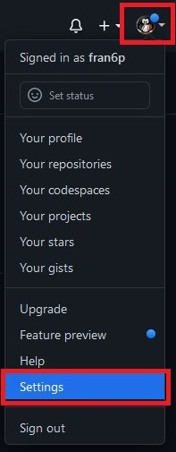

# Passer outre les limites de connexions lors d'une mise à jour Octoprint

L'ensemble des mises à jour Octoprint (base et/ou extensions) passe par Github qui limite le nombre de connexions possibles sur une période de temps donné.

Ayant plusieurs matériels (Raspberry Pi (3B, 3B+, 4B, Zero 2, RPI400…) et une OrangePi Zero 2), j'avais régulièrement des impossibilités de mettre à jour l'ensemble de mes matériels à cause de cette limitation. 

La solution nécessite d'avoir un compte Github et de se créer un «Personal Access Token».
 
Avant la version 1.8.0 d'Octoprint, il fallait ensuite manuellement en allant «bidouiller» le fichier config.yaml et en ajoutant dans la section «softwareupdate», deux lignes (en mettant évidemment les bonnes indentations (pas de tabulation mais 2 / 4 espaces) :

 >     credentials:
 >       github: ghp_KqhX......hAbmZ......ENhi......NlhdW-
 
Il suffiasait ensuite de copier le token recopié du site Github dans la ligne «github: », de redémarrer Octoprint pour ne plus être limité lors de mises à jour :smirk:

Avec la version 1.8.0, cette section «credentials» est désormais présente. Il suffit de se créer un «personal access tpken» via son propre compte Github et de copier sa valeur via l'interface d'Octoprint (Software Update > Settings (icone «clé»)) dans la ligne Github Acces Token puis de sauvegarder pour que cette modification soit prise en compte :smiley:

